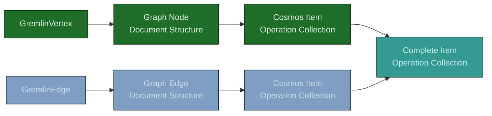
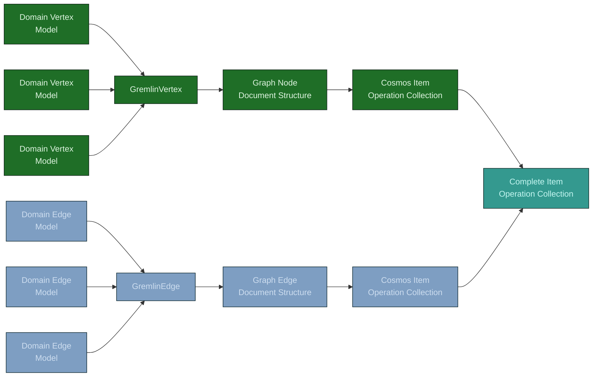

# GraphBulkExecutor

This sample provides an example of using the Java SDK 4.0 for Cosmos Db to execute bulk operations against a Cosmos Database that has been configured to use the Gremlin API. It is a port of the .Net  [GraphBulkExecutorV3](https://github.com/ealsur/GraphBulkExecutorV3).

This sample is useful when hitting performance issues when uploading Vertices and Edges in bulk.

## How it works

When taking this approach, the checks and balances used to ensure the data being uploaded to the database is correct for the Gremlin API are bypassed. This libraries primary function is to create the documents in the required structure (sample document for a [vertex](../../../../../../../../docs/examples/personVertex.json) and [edge](../../../../../../../../docs/examples/relationshipEdge.json)). Those documents are than feed into the bulk operations provided by the Cosmos Db SDK's container object.

There are two ways to harness that functionality. The first requires you to have the data that is being uploaded as POJOs of either the GremlinVertex or GremlinEdge classes defined by the sample library (see Fig 1). The second allows the use of Domain objects defined by your library, but decorated annotations to enable the transformation into the GremlinVertex or GremlinEdge objects. (see Fig 2).

## POJO Flow Explained

This flow requires the use of the GremlinVertex and GremlinEdge class definitions directly. The benefit is that there is one less step in the flow to getting the bulk data loaded. Requiring both less memory and compute to accomplish the job. The down side is that it tightly couples your class domain structure to the GremlinVertex and GremlinEdge implementation.

From left to right the steps in the process are as follows:

* Given a source of either a GremlinVertex or GremlinEdge object.
* Use Json serialization to convert the POJO object into the correct structure for the Gremlin database.
* Use the output of the serialized object to construct a CosmosItemOperation, either as an Upsert or Insert operation depending on the configuration.
* Join the collection of GremlinVertices and GremlinEdges into a single stream to be fed to the Bulk operation in the Cosmos Db SDK.

## Domain Flow

This flow allows for a retrofit of an existing library with the GraphBulkExecutor. It does this by providing a series of Java Annotations to decorate your Domain class definitions with to allow for the transformation into either the GremlinVertex or GremlinEdge object.

Once the Domain objects have been converted into either a GremlinVertex or GremlinEdge, the flow is identical. The conversion is done by using reflection on the class definition of the Domain objects to extract the data based on the presence of the appropriate annotations.

### The annotations

> Some of these annotations are used by both the GremlinVertex and GremlinEdge. While others are only used by one or the other. To articulate which the annotation is usable on, the names are followed by V (Vertex only), E (Edge only) or VE (both Vertex and Edge).

* GremlinEdge (E): Defines the class as a GremlinEdge. A class that doesn't have this decoration, but is still feed into the collection, will cause an exception to be thrown. Two parameters are available for this annotation.
  * label (optional): defines the label value to assign to all edges defined using this class. If not present, the logic will fall back to looking for either a field that has been decorated with the GremlinLabel annotation or a method defined with the GremlinLabelGetter annotation.
  * partitionKeyFieldName (required): defines the name of the field for the partition key. This value should match the partition key path defined on the collection.
* GremlinEdgeVertex (E): Every edge defined needs to know what vertices are on either end of the edge. Both the source and the destination. A field decorated with this annotation defines one of the two sides of the edge. The direction parameter of the annotation tells the logic which side of the edge the property is. The field should be either of type GremlinEdgeVertexInfo or be a reference to a Domain object that has been decorated with the GremlinVertex annotations.
* GremlinId (VE): Identifies the field that contains the value for the id field of the Gremlin object.
* GremlinIgnore (VE): The logic for populating the property bag of either the GremlinEdge or GremlinVertex will collect any field defined that doesn't have an GremlinId, GremlinEdgeVertex, GremlinPartitionKey, GremlinPropertyMap or GremlinLabel. This annotation allows you to ignore a field that you don't need stored in the database.
* GremlinLabel (VE): Defines a field that contains the value to be assigned to the label.
* GremlinLabelGetter (VE): Defines a method on the class, that when called will return the value to be assigned as the label. Important to note, the method should not contain any arguments. An exception will be thrown if an argument has been defined on the method.
* GremlinPartitionKey (VE): Defines a field that contains the data required to construct the partition key information.
* GremlinProperty (VE): Used to define an alternate field name for the property when stored in the database. The name parameter of this annotation will be used for the property when serialized. This annotation is not required to have the field saved to the database. It is only to override the field name.
* GremlinPropertyMap (VE): Defines a field that is of type Map<String, Object>. The data contained in the map will be added to the full property bag that will be stored in the database.
* GremlinVertex (V): Defines the class as a GremlinVertex. A class that doesn't have this decoration, but is still feed into the collection, will cause an exception to be thrown. The label parameter of this class defines the label value to be set on all vertices defined with this class.

> Labels: Please note there are three ways to configure where to get the label value from. The logic will check all three places for the label, in order until found. The sequence it will look is first on the Class level annotation definition (GremlinVertex or GremlinEdge). Then the GremlinLabelGetter annotation, if present, will be checked. Last it will look for the GremlinLabel annotation on a field.
